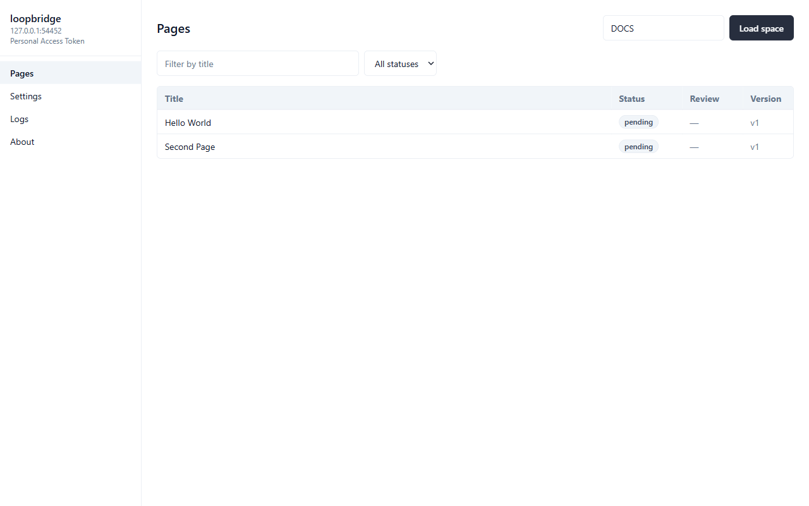
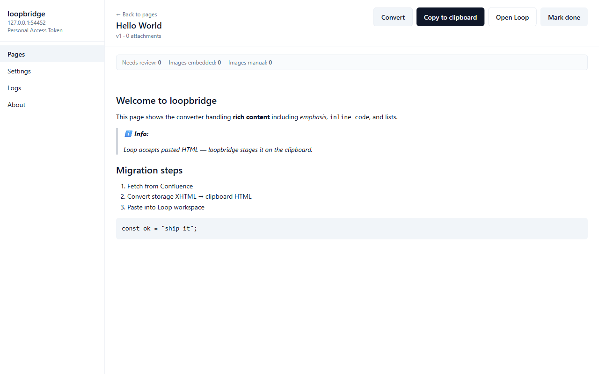

# loopbridge

[](https://github.com/hoangsnowy/loopbridge/actions/workflows/ci.yml)
[](https://github.com/hoangsnowy/loopbridge/actions/workflows/release.yml)
[](https://github.com/hoangsnowy/loopbridge/actions/workflows/codeql.yml)
[](https://opensource.org/licenses/MIT)
[](https://slsa.dev)

> Desktop tool to migrate Confluence space pages into Microsoft Loop via clipboard-assisted paste.

loopbridge is an Electron app that automates everything around the one step Microsoft Loop forces you to do manually: pasting rich content into a workspace. It fetches pages from Confluence (Data Center or Cloud), converts each one into Loop-compatible HTML, stages images for embedding or manual drop, and tracks per-page progress so a multi-hundred-page migration stays sane.

## Screenshots

> Drop screenshots into `docs/screenshots/` and update the paths below.

| Pages list                                | Page preview                                  | Audit + export                            |
| ----------------------------------------- | --------------------------------------------- | ----------------------------------------- |
|  |  |  |

## Why this exists

Microsoft Loop has no public content-write API. Atlassian Confluence has a perfectly serviceable read API. Bridging them today means: a human, a browser, and a lot of copy-paste. loopbridge replaces the tedious 70% of that:

1. **Fetch** — pulls every page in a space via the Confluence DC or Cloud REST API, including attachments.
2. **Convert** — rewrites Confluence storage XHTML (macros, tasks, code blocks, tables, internal links) into clipboard-safe HTML that Loop accepts.
3. **Stage** — converts images to base64 (Loop accepts inline data URLs up to a per-page byte cap), or flags larger images for manual drag-and-drop with a visible marker.
4. **Track** — every page transitions through `pending → fetched → converted → copied → done` in a local SQLite audit log. Skip, retry, export to CSV.

What it does **not** automate: clicking into the right Loop workspace and pressing `Ctrl+V`. That last step is on you.

## Install

### Windows

Download the latest installer from [Releases](https://github.com/hoangsnowy/loopbridge/releases/latest):

- `loopbridge-X.Y.Z-setup.exe` — NSIS installer, recommended for individual users.
- `loopbridge-X.Y.Z-setup.msi` — MSI for SCCM / Group Policy deployment.

The binary is **not yet code-signed** (cert procurement is in progress); SmartScreen will warn on first run. Click **More info → Run anyway**.

Verify the download:

```powershell
Get-FileHash -Algorithm SHA256 loopbridge-X.Y.Z-setup.exe
```

Compare with the SHA256 published in the Release notes. Optionally verify SLSA provenance with [cosign](https://docs.sigstore.dev/cosign/installation/) — see [SECURITY.md](SECURITY.md) for the exact command.

### Linux / macOS

Not currently shipped. The codebase compiles for both, but the release pipeline only packages Windows installers right now. Linux AppImage and macOS dmg will return once there's a dev who actually uses each platform daily (and, for macOS, an Apple Developer certificate to sign + notarize).

## First-run setup

1. Launch the app.
2. **Settings → Confluence**.
3. Pick your backend:
   - **Data Center**: enter your `https://confluence.yourorg.tld` base URL (no trailing slash), choose **PAT** (personal access token) or **basic auth**, paste the secret.
   - **Cloud**: enter `https://yoursite.atlassian.net`, your email, and an [Atlassian API token](https://id.atlassian.com/manage-profile/security/api-tokens).
4. Click **Test connection**. On success, the credentials are saved into the OS keychain via Electron's `safeStorage` and the app advances to the spaces list.

### Confluence DC permissions

The credential needs read access to the spaces you want to migrate. Minimum: `Use Confluence`, `View` on the target space. No write or admin scopes are required — loopbridge never writes back to Confluence.

### Confluence Cloud permissions

The API token inherits your user's permissions. No additional OAuth scopes; the REST endpoints used (`/wiki/api/v2/pages`, `/wiki/api/v2/attachments`, `/wiki/api/v2/users`) are all standard user-level reads.

## Image strategy

Loop accepts inline `data:` image URLs in pasted HTML, but the clipboard payload has a practical size cap (around 8 MB per paste in current Loop builds). Choose a strategy in **Settings → Migration**:

| Strategy         | Behaviour                                                                                                                                                                                                                                 |
| ---------------- | ----------------------------------------------------------------------------------------------------------------------------------------------------------------------------------------------------------------------------------------- |
| `auto` (default) | Embed images as base64 when they fit under `base64MaxBytesPerImage` (default 1 MB) and the page total stays under `base64MaxBytesPerPage` (default 8 MB). Anything larger gets a `<mark>[image: filename]</mark>` marker for manual drag. |
| `base64`         | Embed everything, regardless of size. Risk: clipboard truncation in Loop for oversized pages.                                                                                                                                             |
| `manual`         | Never embed. Every image becomes a manual-drag marker. Fastest, but most manual work.                                                                                                                                                     |

The marker rendering is controlled by `needsReviewMarker` — turn it off if you want clean output for re-export.

## Known limitations

- **Manual paste is unavoidable.** Until Loop ships a content API, the last step is `Ctrl+V` into the right workspace.
- **Large images** above the per-page byte cap require drag-and-drop. The page list flags these in the **needs review** column.
- **Macros without a direct Loop equivalent** (Gliffy, Jira gadgets with JQL, custom internal macros) get a `<mark>[unsupported macro: …]</mark>` placeholder and a `needs-review` counter bump. Review and replace by hand.
- **Internal Confluence links** default to `keep-confluence` — they stay as `https://your-confluence/display/...` URLs so reviewers can verify. Switch to `placeholder` if you want them stubbed.

## Troubleshooting

### "Failed to connect — VPN?"

The app detected `ENOTFOUND` for the Confluence host. Either the DNS name is wrong, or you're off your corporate VPN. Reconnect and retry. The exact error class (`VpnError`) maps `ENOTFOUND`/`EAI_AGAIN`; other transport errors say `NetworkError` or `TlsError` instead.

### "TLS error (CERT_UNTRUSTED)"

Your Confluence DC instance uses a private CA. Point the app at the CA bundle via **Settings → Network → CA bundle path** (PEM file). On Windows, the bundle must be a single concatenated PEM — `.cer` and `.pfx` won't work.

### Behind an HTTPS proxy

Set `HTTPS_PROXY=http://proxy:port` in your user environment **before** launching the app, or set it in **Settings → Network → HTTPS proxy**. The app uses `undici` and will route all Confluence + update-check traffic through the proxy.

### "OS keychain unavailable — cannot store secrets"

On Linux, install `libsecret` and ensure `gnome-keyring` (or the KDE wallet equivalent) is running. The app refuses to fall back to plaintext storage.

### Logs

Logs live at `~/.config/loopbridge/logs/` (Linux) or `%APPDATA%\loopbridge\logs\` (Windows). Files rotate daily and at 10 MB, retained for the number of days configured by `logging.fileRetentionDays` (default 14). Click **Settings → Open log folder** to jump straight there.

## Auto-update

Releases are served via GitHub Releases — `electron-updater` polls this repo for new tags. To opt out, set `updater.autoDownload: false` in your config; the app will then only check on demand from **Settings → Check for updates**.

## Configuration

Config lives at `userData/config.json`. It is validated by zod on every read, so a malformed value produces a startup error rather than a silent fallback. See [`src/shared/config-schema.ts`](src/shared/config-schema.ts) for the authoritative shape.

## Contributing

See [CONTRIBUTING.md](.github/CONTRIBUTING.md) for development setup, commit conventions, and the PR checklist. Bug reports and feature requests use issue templates under [`.github/ISSUE_TEMPLATE/`](.github/ISSUE_TEMPLATE/).

Security vulnerabilities: do **not** open public issues. See [SECURITY.md](SECURITY.md) for the disclosure flow.

## License

[MIT](LICENSE).
